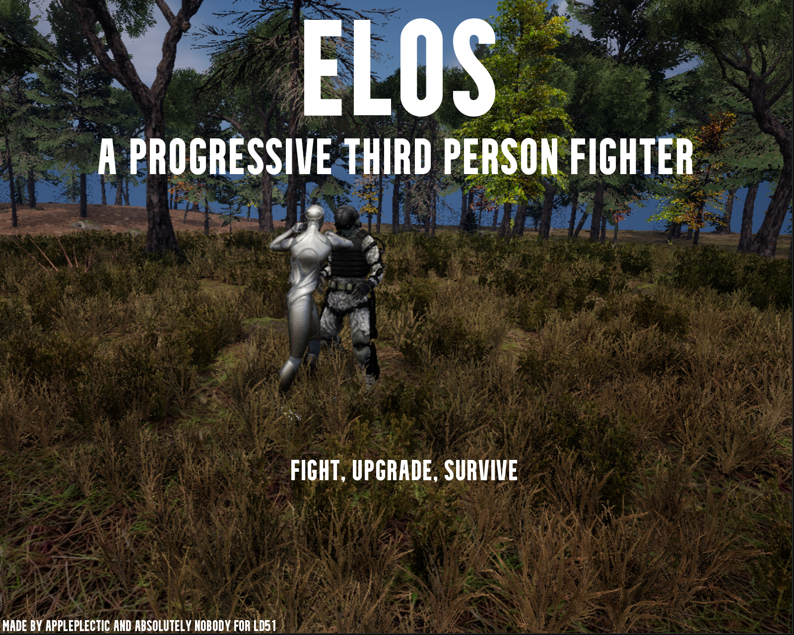

# Elos

Fight. Upgrade. Survive.

### Elos is a third person progressive fighter made in Unreal Engine.

Enemies are coming at you every 10 seconds. Big and small, tough or weak, these zombies are bloodthirsty and desperate for revenge. Do you have what it takes to fend them off as you progress through 3 handcrafted environments?

Minimum System Specs: 4GB RAM, average 6 year old processor (i.e. i5 6th gen)

Recommended System Specs: 8GB RAM, recent processor, dedicated graphics

How to install: download the ZIP file, extract it to a location of your choosing, and run Elos.exe inside of the Windows folder. Note that if a blue Windows Defender SmartScreen window pops up, you must click "More info" and then "Run Anyways" to start the game.

**Known Issues: **

If an Intel Graphics Driver error appears, you can try dismissing it. Some users reported the world being red - selecting a graphics preset from the Options menu sometimes mitigated this. This is an issue with Unreal Engine, and not with the game.

The "Fullscreen" graphics setting sometimes does not work.

=================================================================

All rights reserved, Appleplectic and Absolutely Nobody, 2022. Do not distribute, claim as your own, copy, etc., without the written permission of the owners of this work.

Some icons by icons8.
